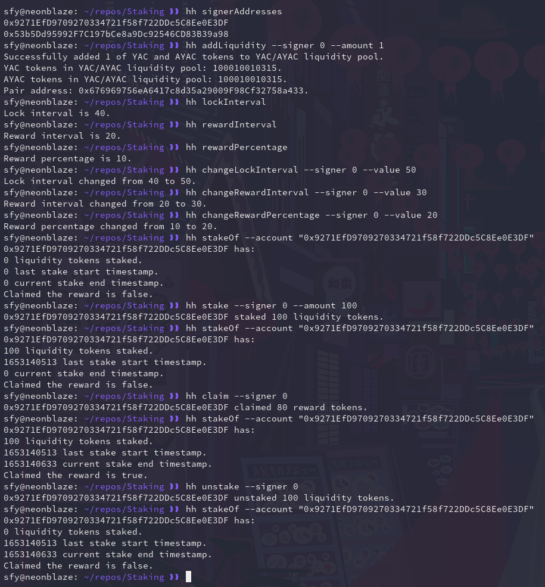

# Staking 🏦

A simple ERC-20 staking contract for the Uniswap testnet I made to better understand the concept of staking.

## Features

- [x] A separate _addLiquidity_ tasks to create/add to the Uniswap liquidity pool.
- [x] All interfaces exposed in the ABI have a corresponding task in _tasks/_. 
- [x] All interfaces in the ABI are covered by NatSpec annotations.
- [ ] Includes tests which provide 100% coverage accoring to _solidity-coverage_.
- [x] Deployment scripts are stored in _scripts/_.
- [x] All private deployment data is stored using [dotenv](https://www.npmjs.com/package/dotenv).
- [x] The contract is deployed to the Rinkeby testnet @0x81E559EedBb2053081e4F88Fae4c590412745638.
- [x] Additional _verify_ task is made to easily verify the contract after deployment.
- [x] Verified contract is available on [Etherscan](https://rinkeby.etherscan.io/address/0x81E559EedBb2053081e4F88Fae4c590412745638#code).

## Usage

**IMPORTANT: all variable data needed to deploy/use/test the contract is stored in config.ts**

```
cat config.ts
const config = {
  RINKEBY_ADDRESS: "0x81E559EedBb2053081e4F88Fae4c590412745638",
  ROUTER02_ADDRESS: "0x7a250d5630B4cF539739dF2C5dAcb4c659F2488D",
  FACTORY_ADDRESS: "0x5C69bEe701ef814a2B6a3EDD4B1652CB9cc5aA6f",
  LIQUIDITY_TOKEN_ADDRESS: "0x676969756eA6417c8d35a29009F98Cf32758a433",
  TOKEN0_ADDRESS: "0xfAA8C0Beb910f8CF1a4F12Ef7848BA759550A9Ce",
  TOKEN1_ADDRESS: "0x146920e4384A60310e5499A4cb9A00B5C7c39feD",
  REWARD_PERCENTAGE: 10,
  REWARD_INTERVAL: 20,
  LOCK_INTERVAL: 40
};

export default config;
```

Contract follows a _stake() → claim() → unstake()_ pattern.

0. Create or add to an existing liquidity pool to receive liquidity tokens:

```
hh addLiquidity --signer 0 --amount 200
Successfully added 200 of YAC and AYAC tokens to YAC/AYAC liquidity pool.
YAC tokens in YAC/AYAC liquidity pool: 100010010314
AYAC tokens in YAC/AYAC liquidity pool: 100010010314
Pair address: 0x676969756eA6417c8d35a29009F98Cf32758a433
```

1. Stake liquidity tokens:

```
hh stake --signer 0 --amount 100
0x9271EfD9709270334721f58f722DDc5C8Ee0E3DF staked 100 liquidity tokens.
```

2. After some time (which should be greater than _LOCK_INTERVAL_) claim the reward in reward tokens:

```
hh claim --signer 0
0x9271EfD9709270334721f58f722DDc5C8Ee0E3DF claimed 40 reward tokens.
```

3. Unstake liquidity tokens:

```
hh unstake --signer 0
0x9271EfD9709270334721f58f722DDc5C8Ee0E3DF unstaked 100 liquidity tokens.
```

Repeat as many times as you'd like to :)

P.S. _hh_ is an alias for _npx hardhat_.

## Demonstration


